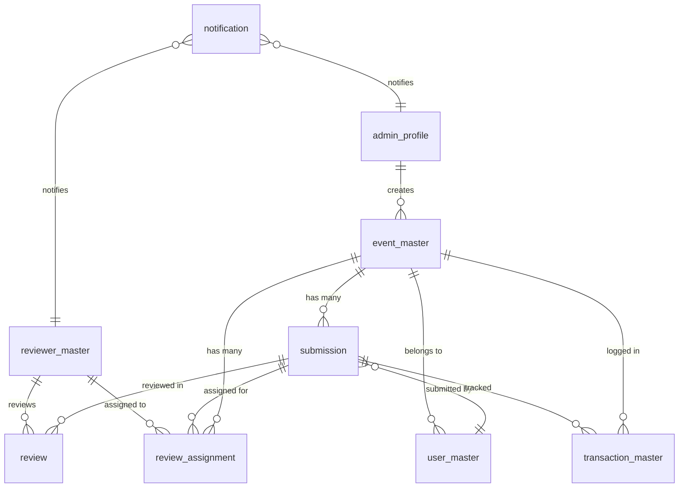

# FormFlow — Database Schema

> **On-Demand Context**: Read this file before working on database migrations, queries, or RLS policies.

---

## Entity Relationship Diagram

---

## Tables

### 1. `admin_profile`

Stores admin user data. Linked to `auth.users` via NextAuth.

| Column         | Type        | Constraints              | Notes                     |
| -------------- | ----------- | ------------------------ | ------------------------- |
| `id`           | UUID        | PK, DEFAULT uuid_generate_v4() | Internal ID               |
| `auth_user_id` | UUID        | UNIQUE, NOT NULL, FK → auth.users | NextAuth user reference   |
| `name`         | TEXT        | NOT NULL                 |                           |
| `email`        | TEXT        | UNIQUE, NOT NULL         |                           |
| `avatar_url`   | TEXT        | NULLABLE                 |                           |
| `role`         | TEXT        | DEFAULT 'admin'          | Always 'admin' for now    |
| `is_active`    | BOOLEAN     | DEFAULT true             |                           |
| `created_at`   | TIMESTAMPTZ | DEFAULT now()            |                           |
| `updated_at`   | TIMESTAMPTZ | DEFAULT now()            | Auto-updated via trigger  |

---

### 2. `event_master`

Stores event configurations and form definitions. The **core organizational unit** — all data is scoped to an event.

| Column            | Type        | Constraints              | Notes                                      |
| ----------------- | ----------- | ------------------------ | ------------------------------------------ |
| `id`              | UUID        | PK, DEFAULT uuid_generate_v4() |                                            |
| `title`           | TEXT        | NOT NULL                 | Event / form title                          |
| `description`     | TEXT        | NULLABLE                 | Event description shown on form page        |
| `form_schema`     | JSONB       | DEFAULT '{"fields":[]}' | Form field definitions (see PRD for shape)  |
| `review_layers`   | INTEGER     | NOT NULL, DEFAULT 1      | Number of review layers (1, 2, 3...)        |
| `scoring_type`    | TEXT        | NOT NULL, DEFAULT 'numeric' | 'numeric' (out of 100) or 'grade'         |
| `grade_config`    | JSONB       | NULLABLE                 | Grade definitions: `[{"label":"A","min":90,"max":100},...]` |
| `max_score`       | INTEGER     | DEFAULT 100              | Max score for numeric type                  |
| `status`          | TEXT        | NOT NULL, DEFAULT 'draft' | 'draft', 'published', 'closed'             |
| `share_slug`      | TEXT        | UNIQUE, NOT NULL         | URL slug for shareable link (auto-generated)|
| `max_file_size`   | INTEGER     | DEFAULT 20971520         | Max file size in bytes (20MB)               |
| `allowed_file_types` | TEXT[]   | DEFAULT '{}'             | Allowed MIME types (empty = all)            |
| `expiration_date` | TIMESTAMPTZ | NULLABLE                 | After this date, form shows "closed"        |
| `teacher_fields`  | JSONB       | DEFAULT '["name","email","school_name"]' | Which teacher info fields to collect |
| `created_by`      | UUID        | NOT NULL, FK → admin_profile.id |                                      |
| `created_at`      | TIMESTAMPTZ | DEFAULT now()            |                                            |
| `updated_at`      | TIMESTAMPTZ | DEFAULT now()            |                                            |

**Indexes**:
- `idx_event_share_slug` ON `share_slug` (for public form lookup)
- `idx_event_status` ON `status`
- `idx_event_created_by` ON `created_by`

---

### 3. `user_master`

Stores teacher (form submitter) data. Teachers do NOT have auth accounts.

| Column        | Type        | Constraints              | Notes                          |
| ------------- | ----------- | ------------------------ | ------------------------------ |
| `id`          | UUID        | PK, DEFAULT uuid_generate_v4() |                                |
| `event_id`    | UUID        | NOT NULL, FK → event_master.id | Which event they submitted for |
| `name`        | TEXT        | NOT NULL                 |                                |
| `email`       | TEXT        | NOT NULL                 | Used for draft links & confirmation |
| `phone`       | TEXT        | NULLABLE                 |                                |
| `school_name` | TEXT        | NULLABLE                 |                                |
| `metadata`    | JSONB       | DEFAULT '{}'             | Any additional teacher-specific data |
| `created_at`  | TIMESTAMPTZ | DEFAULT now()            |                                |

**Indexes**:
- `idx_user_event` ON `event_id`
- `idx_user_email_event` ON `(email, event_id)` — for finding teacher across submissions

---

### 4. `submission`

Stores actual form submissions (response data).

| Column              | Type        | Constraints              | Notes                               |
| ------------------- | ----------- | ------------------------ | ----------------------------------- |
| `id`                | UUID        | PK, DEFAULT uuid_generate_v4() |                                     |
| `event_id`          | UUID        | NOT NULL, FK → event_master.id |                                     |
| `user_id`           | UUID        | NOT NULL, FK → user_master.id |                                      |
| `form_data`         | JSONB       | DEFAULT '{}'             | `{ "field_id": "response_value" }`  |
| `file_attachments`  | JSONB       | DEFAULT '[]'             | `[{ "field_id": "...", "file_url": "...", "file_name": "...", "file_size": 123 }]` |
| `status`            | TEXT        | NOT NULL, DEFAULT 'draft' | 'draft', 'submitted'                |
| `submission_number` | INTEGER     | NOT NULL, DEFAULT 1      | Increments per teacher re-submission |
| `current_layer`     | INTEGER     | DEFAULT 0                | 0 = not yet in review, 1 = R1, etc. |
| `review_status`     | TEXT        | DEFAULT 'pending'        | 'pending', 'in_review', 'advanced', 'eliminated' |
| `eliminated_at_layer` | INTEGER   | NULLABLE                 | Which layer it was eliminated at     |
| `draft_token`       | TEXT        | UNIQUE, NULLABLE         | Token for teacher to resume draft    |
| `draft_token_expires` | TIMESTAMPTZ | NULLABLE               | Draft token expiration               |
| `submitted_at`      | TIMESTAMPTZ | NULLABLE                 | When status changed to 'submitted'   |
| `created_at`        | TIMESTAMPTZ | DEFAULT now()            |                                     |
| `updated_at`        | TIMESTAMPTZ | DEFAULT now()            |                                     |

**Indexes**:
- `idx_submission_event` ON `event_id`
- `idx_submission_user` ON `user_id`
- `idx_submission_status` ON `status`
- `idx_submission_event_status` ON `(event_id, status)` — most common query pattern
- `idx_submission_draft_token` ON `draft_token` WHERE `draft_token IS NOT NULL`
- `idx_submission_review_status` ON `(event_id, review_status, current_layer)` — for review pipeline queries

---

### 5. `reviewer_master`

Stores reviewer profiles. Linked to `auth.users` via NextAuth.

| Column         | Type        | Constraints              | Notes                     |
| -------------- | ----------- | ------------------------ | ------------------------- |
| `id`           | UUID        | PK, DEFAULT uuid_generate_v4() |                           |
| `auth_user_id` | UUID        | UNIQUE, NOT NULL, FK → auth.users |                        |
| `name`         | TEXT        | NOT NULL                 |                           |
| `email`        | TEXT        | UNIQUE, NOT NULL         |                           |
| `phone`        | TEXT        | NULLABLE                 |                           |
| `department`   | TEXT        | NULLABLE                 |                           |
| `specialization` | TEXT      | NULLABLE                 | Subject area expertise    |
| `metadata`     | JSONB       | DEFAULT '{}'             |                           |
| `is_active`    | BOOLEAN     | DEFAULT true             |                           |
| `created_at`   | TIMESTAMPTZ | DEFAULT now()            |                           |
| `updated_at`   | TIMESTAMPTZ | DEFAULT now()            |                           |

**Indexes**:
- `idx_reviewer_auth_user` ON `auth_user_id`
- `idx_reviewer_active` ON `is_active`

---

### 6. `review_assignment`

Links reviewers to specific submissions at specific layers. This is the **assignment** — the reviewer's "to-do" item.

| Column          | Type        | Constraints              | Notes                         |
| --------------- | ----------- | ------------------------ | ----------------------------- |
| `id`            | UUID        | PK, DEFAULT uuid_generate_v4() |                               |
| `event_id`      | UUID        | NOT NULL, FK → event_master.id |                               |
| `submission_id` | UUID        | NOT NULL, FK → submission.id |                               |
| `reviewer_id`   | UUID        | NOT NULL, FK → reviewer_master.id |                           |
| `layer`         | INTEGER     | NOT NULL                 | Which review layer (1, 2, 3...) |
| `status`        | TEXT        | NOT NULL, DEFAULT 'pending' | 'pending', 'in_progress', 'completed' |
| `is_override`   | BOOLEAN     | DEFAULT false            | True if admin manually overrode assignment |
| `assigned_by`   | UUID        | NOT NULL, FK → admin_profile.id |                           |
| `assigned_at`   | TIMESTAMPTZ | DEFAULT now()            |                               |
| `completed_at`  | TIMESTAMPTZ | NULLABLE                 |                               |

**Unique Constraint**: `(submission_id, reviewer_id, layer)` — one reviewer per submission per layer

**Indexes**:
- `idx_assignment_reviewer` ON `reviewer_id` — for reviewer's dashboard
- `idx_assignment_event_layer` ON `(event_id, layer)`
- `idx_assignment_submission` ON `submission_id`
- `idx_assignment_status` ON `(reviewer_id, status)` — for pending assignments query

---

### 7. `review`

Stores actual review scores/grades. One review per assignment.

| Column          | Type        | Constraints              | Notes                         |
| --------------- | ----------- | ------------------------ | ----------------------------- |
| `id`            | UUID        | PK, DEFAULT uuid_generate_v4() |                               |
| `assignment_id` | UUID        | UNIQUE, NOT NULL, FK → review_assignment.id |                   |
| `event_id`      | UUID        | NOT NULL, FK → event_master.id |                               |
| `submission_id` | UUID        | NOT NULL, FK → submission.id |                               |
| `reviewer_id`   | UUID        | NOT NULL, FK → reviewer_master.id |                           |
| `layer`         | INTEGER     | NOT NULL                 |                               |
| `score`         | DECIMAL(5,2)| NULLABLE                 | Numeric score (0.00 - 100.00) |
| `grade`         | TEXT        | NULLABLE                 | Letter grade if event uses grades |
| `notes`         | TEXT        | NULLABLE                 | Reviewer's comments            |
| `reviewed_at`   | TIMESTAMPTZ | DEFAULT now()            |                               |
| `created_at`    | TIMESTAMPTZ | DEFAULT now()            |                               |
| `updated_at`    | TIMESTAMPTZ | DEFAULT now()            |                               |

**Indexes**:
- `idx_review_event` ON `event_id`
- `idx_review_submission` ON `submission_id`
- `idx_review_reviewer` ON `reviewer_id`
- `idx_review_submission_layer` ON `(submission_id, layer)` — for reviewer continuity lookups

---

### 8. `transaction_master`

Audit log tracking the lifecycle of every form. Append-only.

| Column          | Type        | Constraints              | Notes                         |
| --------------- | ----------- | ------------------------ | ----------------------------- |
| `id`            | UUID        | PK, DEFAULT uuid_generate_v4() |                               |
| `event_id`      | UUID        | NOT NULL, FK → event_master.id |                               |
| `submission_id` | UUID        | NULLABLE, FK → submission.id | NULL for event-level actions   |
| `user_id`       | UUID        | NULLABLE, FK → user_master.id | Teacher who did the action     |
| `action`        | TEXT        | NOT NULL                 | See Action Types below         |
| `actor_id`      | UUID        | NULLABLE                 | Who performed action (admin/reviewer UUID) |
| `actor_type`    | TEXT        | NOT NULL                 | 'system', 'admin', 'reviewer', 'teacher' |
| `metadata`      | JSONB       | DEFAULT '{}'             | Action-specific data           |
| `created_at`    | TIMESTAMPTZ | DEFAULT now()            |                               |

**Action Types**:
- `event_created`, `event_published`, `event_closed`
- `link_generated`
- `form_opened`, `draft_saved`, `form_submitted`, `form_resubmitted`
- `reviewer_assigned_r1`, `reviewer_assigned_r2`, `reviewer_assigned_r3`...
- `review_started_r1`, `review_completed_r1`...
- `submission_advanced_r2`, `submission_eliminated_r1`...
- `assignment_override`

**Indexes**:
- `idx_transaction_event` ON `event_id`
- `idx_transaction_submission` ON `submission_id`
- `idx_transaction_action` ON `action`
- `idx_transaction_created` ON `created_at` — for timeline queries

---

### 9. `notification`

In-app notifications for admins and reviewers.

| Column          | Type        | Constraints              | Notes                         |
| --------------- | ----------- | ------------------------ | ----------------------------- |
| `id`            | UUID        | PK, DEFAULT uuid_generate_v4() |                               |
| `recipient_id`  | UUID        | NOT NULL                 | Admin or reviewer profile ID   |
| `recipient_type`| TEXT        | NOT NULL                 | 'admin' or 'reviewer'          |
| `title`         | TEXT        | NOT NULL                 |                               |
| `message`       | TEXT        | NOT NULL                 |                               |
| `type`          | TEXT        | NOT NULL                 | 'assignment', 'submission', 'review_complete', 'system' |
| `action_url`    | TEXT        | NULLABLE                 | URL to navigate to on click    |
| `is_read`       | BOOLEAN     | DEFAULT false            |                               |
| `metadata`      | JSONB       | DEFAULT '{}'             |                               |
| `created_at`    | TIMESTAMPTZ | DEFAULT now()            |                               |

**Indexes**:
- `idx_notification_recipient` ON `(recipient_id, recipient_type, is_read)` — main query pattern
- `idx_notification_created` ON `created_at`

---

## Row Level Security (RLS) Policies

### `event_master`
- **Admins**: Full CRUD on their own events (`created_by = auth.uid()`)
- **Reviewers**: SELECT only on events they have assignments for
- **Public (anon)**: SELECT only on published events (for form page) — limited columns

### `submission`
- **Admins**: Full SELECT on submissions for their events
- **Reviewers**: SELECT only on submissions assigned to them
- **Public (anon)**: INSERT (for form submission), UPDATE on own draft (via `draft_token`)

### `review_assignment`
- **Admins**: Full CRUD on assignments for their events
- **Reviewers**: SELECT on their own assignments

### `review`
- **Admins**: SELECT on reviews for their events
- **Reviewers**: INSERT/UPDATE on their own reviews, SELECT on their own previous reviews

### `transaction_master`
- **Admins**: SELECT on transactions for their events
- **System/Service Role**: INSERT only (append-only audit log)

### `notification`
- **Admins/Reviewers**: SELECT/UPDATE (read status) on their own notifications

---

## Database Functions

### `fn_generate_share_slug()`
- Generates a unique 8-character alphanumeric slug for event share links
- Called on event creation

### `fn_update_timestamp()`
- Trigger function that sets `updated_at = now()` on UPDATE
- Applied to all tables with `updated_at` column

### `fn_log_transaction()`
- Helper function for inserting transaction_master records
- Called from application code, not as a trigger (for flexibility)

---

## Storage Buckets

### `form-uploads`
- **Path structure**: `{event_id}/{submission_id}/{uuid}_{original_filename}`
- **Max file size**: 20MB (enforced at bucket level)
- **RLS**: Public INSERT (teachers uploading), Admin/Reviewer SELECT on assigned submissions
- **Lifecycle**: Files for deleted events should be cleaned up (scheduled job)
