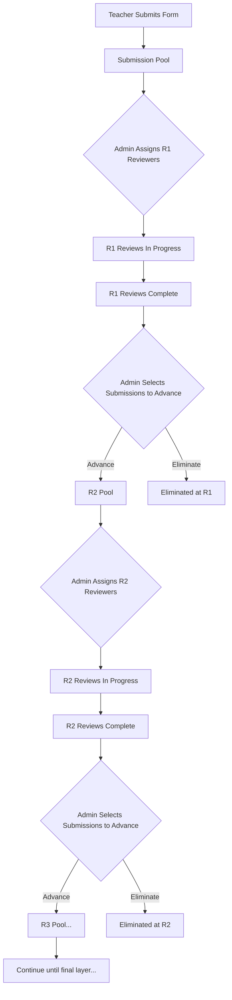
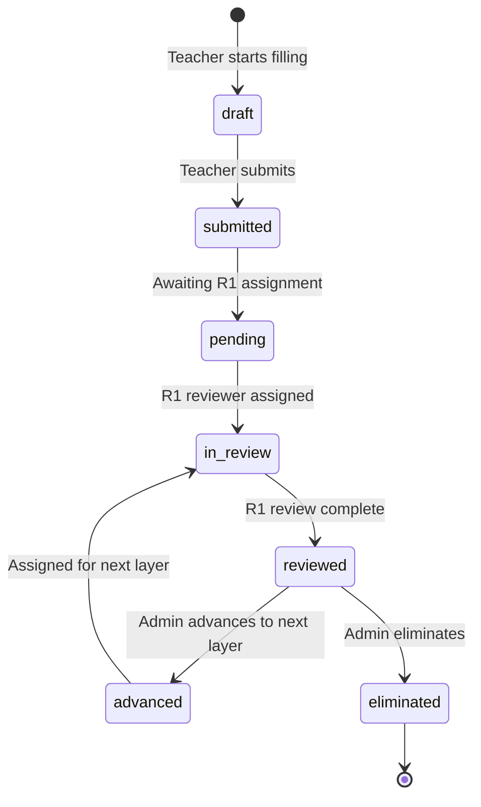

# FormFlow — Review System

> **On-Demand Context**: Read this file before working on review pipeline, layer advancement, or reviewer assignment logic.

---

## Review Pipeline Overview

The review system is a **sequential funnel**. Submissions flow through configurable layers, with each layer narrowing down the pool. The Admin manually controls advancement between layers.



---

## Submission States

A submission moves through these states during the review pipeline:



| `review_status` | `current_layer` | Meaning                                |
| --------------- | --------------- | -------------------------------------- |
| `pending`       | 0               | Submitted, not yet in any review layer |
| `in_review`     | 1               | Currently being reviewed at R1         |
| `reviewed`      | 1               | R1 review complete, awaiting admin decision |
| `advanced`      | 2               | Advanced to R2 by admin                |
| `in_review`     | 2               | Currently being reviewed at R2         |
| `eliminated`    | 1               | Eliminated by admin after R1           |

---

## Key Business Rules

### 1. Sequential Layer Processing
- A submission MUST complete all reviews at Layer N before it can advance to Layer N+1.
- A reviewer CANNOT review a submission at Layer N+1 until it has been explicitly advanced by the Admin.
- Layers are numbered 1, 2, 3... up to `event_master.review_layers`.

### 2. Assignment Rules
- Admin assigns specific submissions to specific reviewers at a specific layer.
- A reviewer can only be assigned to a submission ONCE per layer (`UNIQUE(submission_id, reviewer_id, layer)`).
- Multiple reviewers can review the same submission at the same layer (for consensus).
- Admin override: Admin can assign a reviewer to a submission they wouldn't normally see. This sets `is_override = true` on the assignment.

### 3. Reviewer Continuity
- If a reviewer is assigned to the same submission across multiple layers (e.g., R1 and R2):
  - They can **view** their own scores and notes from previous layers.
  - They CANNOT edit previous layer reviews.
- Query for continuity: `SELECT * FROM review WHERE submission_id = X AND reviewer_id = Y AND layer < current_layer ORDER BY layer ASC`

### 4. Scoring
- **Numeric mode** (`scoring_type = 'numeric'`): Score 0.00 - 100.00 (or up to `max_score`)
- **Grade mode** (`scoring_type = 'grade'`): Admin defines grade labels and ranges in `grade_config`
  ```json
  [
    {"label": "A+", "min": 95, "max": 100},
    {"label": "A",  "min": 90, "max": 94},
    {"label": "B+", "min": 85, "max": 89},
    {"label": "B",  "min": 80, "max": 84},
    {"label": "C",  "min": 70, "max": 79},
    {"label": "D",  "min": 60, "max": 69},
    {"label": "F",  "min": 0,  "max": 59}
  ]
  ```
- **No cross-layer aggregation**: Scores at each layer are independent. No weighted averages.

### 5. Layer Advancement (Admin-Controlled)
- After all assignments at Layer N are completed, Admin sees the results.
- Admin manually selects which submissions advance to Layer N+1.
- Non-advancing submissions are marked `review_status = 'eliminated'`, `eliminated_at_layer = N`.
- Advancing submissions are marked `review_status = 'advanced'`, `current_layer = N+1`.
- Admin then creates assignments for Layer N+1, starting the next review cycle.

### 6. Admin Override
- Admin can grant a reviewer access to additional submissions beyond their normal assignments.
- This creates a `review_assignment` with `is_override = true`.
- Override assignments work identically to normal assignments once created.
- Use case: A reviewer is an expert in a specific area and Admin wants their input on extra submissions.

---

## API Flow for Review Lifecycle

### Step 1: Admin assigns submissions to R1 reviewers
```
POST /api/reviews/assign
Body: {
  event_id: "uuid",
  assignments: [
    { submission_id: "uuid", reviewer_id: "uuid", layer: 1 },
    { submission_id: "uuid", reviewer_id: "uuid", layer: 1 },
    ...
  ]
}
```
- Creates `review_assignment` records
- Updates `submission.review_status = 'in_review'`, `submission.current_layer = 1`
- Creates `transaction_master` entries
- Sends notification to each assigned reviewer

### Step 2: Reviewer completes a review
```
POST /api/reviews/submit
Body: {
  assignment_id: "uuid",
  score: 85.5,        // OR grade: "A"
  notes: "Excellent submission..."
}
```
- Creates `review` record
- Updates `review_assignment.status = 'completed'`, `review_assignment.completed_at = now()`
- Creates `transaction_master` entry
- If ALL assignments for this submission at this layer are complete:
  - Updates `submission.review_status = 'reviewed'`

### Step 3: Admin advances/eliminates submissions
```
POST /api/reviews/advance
Body: {
  event_id: "uuid",
  layer: 1,  // The layer they're advancing FROM
  advance: ["submission_uuid_1", "submission_uuid_2"],
  eliminate: ["submission_uuid_3", "submission_uuid_4"]
}
```
- Advanced: `submission.review_status = 'advanced'`, `submission.current_layer += 1`
- Eliminated: `submission.review_status = 'eliminated'`, `submission.eliminated_at_layer = layer`
- Creates `transaction_master` entries for each action

### Step 4: Admin assigns R2 reviewers (repeat Step 1 at layer 2)

---

## Reviewer Dashboard Queries

### Get my pending assignments
```sql
SELECT ra.*, s.form_data, s.file_attachments, em.title, em.form_schema, em.scoring_type
FROM review_assignment ra
JOIN submission s ON ra.submission_id = s.id
JOIN event_master em ON ra.event_id = em.id
WHERE ra.reviewer_id = :reviewer_id
  AND ra.status IN ('pending', 'in_progress')
ORDER BY ra.assigned_at ASC;
```

### Get my previous reviews for continuity
```sql
SELECT r.score, r.grade, r.notes, r.layer, r.reviewed_at
FROM review r
WHERE r.submission_id = :submission_id
  AND r.reviewer_id = :reviewer_id
  AND r.layer < :current_layer
ORDER BY r.layer ASC;
```

---

## Admin Dashboard Queries

### Submissions per event with review progress
```sql
SELECT 
  s.id,
  s.review_status,
  s.current_layer,
  s.submitted_at,
  um.name AS teacher_name,
  um.school_name,
  COUNT(DISTINCT ra.id) FILTER (WHERE ra.status = 'completed') AS reviews_completed,
  COUNT(DISTINCT ra.id) AS total_assignments,
  AVG(r.score) AS avg_score_current_layer
FROM submission s
JOIN user_master um ON s.user_id = um.id
LEFT JOIN review_assignment ra ON s.id = ra.submission_id AND ra.layer = s.current_layer
LEFT JOIN review r ON s.id = r.submission_id AND r.layer = s.current_layer
WHERE s.event_id = :event_id
  AND s.status = 'submitted'
GROUP BY s.id, um.name, um.school_name
ORDER BY s.submitted_at DESC;
```

---

## Edge Cases & Error Handling

| Scenario | Behavior |
| -------- | -------- |
| Reviewer tries to access unassigned submission | 403 Forbidden (RLS enforced) |
| Admin tries to advance submission with incomplete reviews | Error: "All reviews at Layer N must be complete before advancing" |
| Reviewer submits review for already-completed assignment | Error: "This review has already been submitted" |
| Admin assigns reviewer to a layer beyond event's `review_layers` | Error: "Event only has N review layers" |
| Admin tries to eliminate an already-advanced submission | Error: "Submission has already been advanced to Layer N+1" |
| Reviewer assigned to same submission at L1 and L2, currently at L2 | Show L1 scores as read-only in the L2 evaluation interface |
| Event is closed while reviews are in progress | All pending assignments remain accessible; no new assignments can be created |
